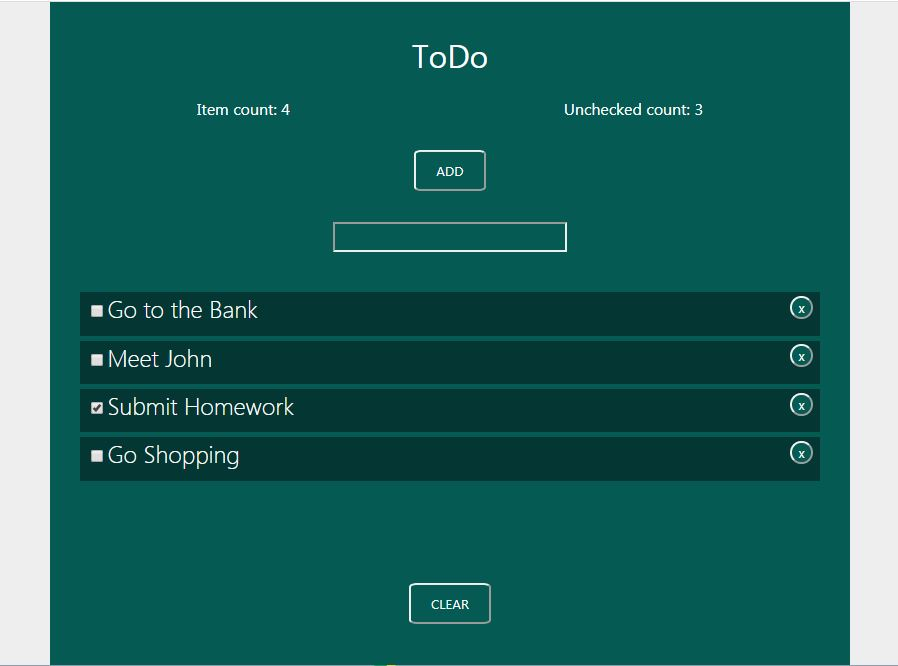

# ToDo App

### General
This project is a web app written in vanilla JavaScript. The app adds tasks to be done in a list and also keeps count of total items and unchecked items in that list. The user can delete a particular task or clear all the tasks instantly using the functionality provided.

### How to run
* Project live [here](https://vaibhavmanni.github.io/to-do-app/).

OR
* Run index.html file. The app will launch in your default browser.

### Screenshot

